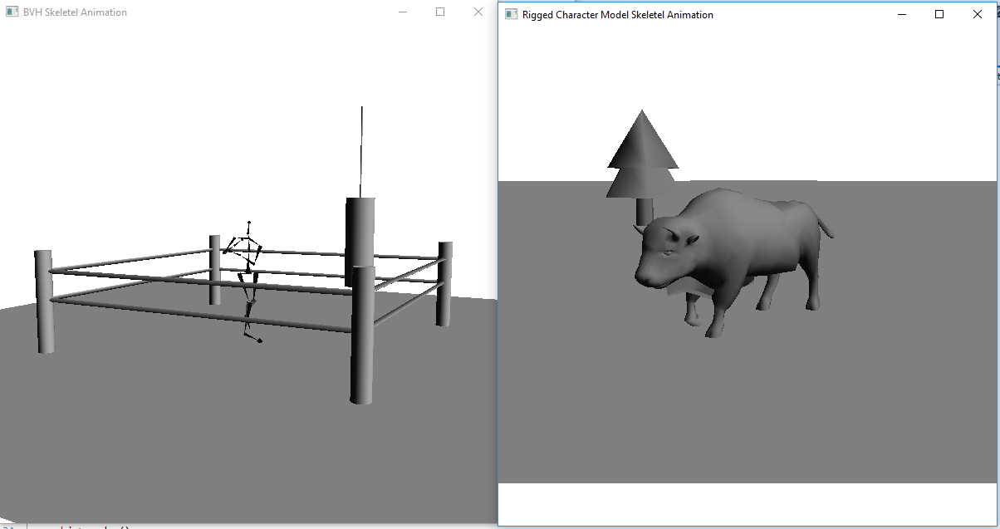

# Skeletel Animation
COSC422 Skeletel Animation Assignment (Assignment 2)



Mark:
----
A+ (100%). "Excellent implementations of character animation algorithms. The code is very well structured and the report well presented."

Compiling:
----

```bash
mkdir build
cd build
cmake ..
make
./SkeletalAnimation
```

Running:
----
Ensure that the objects directory is located in the current working directory (usually same as executable) and run the program as normal.

Why Is There Only One Program?
----
Yes, the assignment called for two programs, but instead I made them both run simaltaneously from the same executable.

License:
----
Licensed under the MIT license and other applicable licenses where stated.
